# Baccouche Motors - Comprehensive Application Review Report

---

## Table of Contents

1. [Project Overview](#1-project-overview)
2. [Architecture](#2-architecture)
3. [Users & Roles](#3-users--roles)
4. [Use Cases by User Type](#4-use-cases-by-user-type)
5. [Frontend Analysis](#5-frontend-analysis)
6. [Backend Analysis](#6-backend-analysis)
7. [Entities & Database Schema](#7-entities--database-schema)
8. [API Endpoints Summary](#8-api-endpoints-summary)
9. [Infrastructure & Deployment](#9-infrastructure--deployment)
10. [Security Features](#10-security-features)
11. [UML Diagrams](#11-uml-diagrams)
12. [Summary](#12-summary)

---

## 1. Project Overview

This is a **full-stack car dealership application** consisting of two main parts:

| Component    | Type                 | Description                       |
| ------------ | -------------------- | --------------------------------- |
| **Backend**  | NestJS Microservices | REST API with API Gateway pattern |
| **Frontend** | Next.js 16 App       | React-based web application       |

### 1.1 Technology Stack Summary

#### Backend Stack

| Category          | Technology              |
| ----------------- | ----------------------- |
| Runtime           | Node.js                 |
| Framework         | NestJS v11              |
| Language          | TypeScript v5.7         |
| Database          | PostgreSQL 16           |
| ORM               | TypeORM v0.3            |
| Message Broker    | RabbitMQ 3              |
| Authentication    | JWT + bcrypt            |
| API Documentation | Swagger/OpenAPI         |
| Testing           | Jest v30                |
| Container         | Docker + Docker Compose |

#### Frontend Stack

| Category         | Technology               |
| ---------------- | ------------------------ |
| Framework        | Next.js 16.1.6           |
| UI Library       | React 19.2.3             |
| Language         | TypeScript 5.x           |
| Styling          | Tailwind CSS v4          |
| UI Components    | shadcn/ui v4.1.2         |
| State Management | TanStack React Query v5  |
| Form Handling    | React Hook Form v7 + Zod |
| HTTP Client      | Axios                    |
| Rich Text Editor | TipTap v3                |
| Charts           | Recharts                 |
| Testing          | Cypress (E2E) + Vitest   |

---

## 2. Architecture

### 2.1 Overall System Architecture

```mermaid
graph TB
    subgraph "Frontend (Next.js)"
        FW[Web Browser]
    end

    subgraph "API Gateway (NestJS)"
        GW[Gateway<br/]:3500]
    end

    subgraph "Backend Services (Microservices)"
        subgraph "Message Broker (RabbitMQ)"
            RMQ[RabbitMQ<br/>:5672]
        end

        SERVICES[
            AUTH[Auth<br/>:3501]
            CARS[Cars<br/>:3502]
            NEWS[News<br/>:3503]
            TESTDRIVE[Test Drives<br/>:3504]
            CONTACTS[Contacts<br/>:3505]
            ADMIN[Admin<br/>:3506]
        ]
    end

    subgraph "Database Layer (PostgreSQL)"
        DB1[baccouche_auth]
        DB2[baccouche_cars]
        DB3[baccouche_news]
        DB4[baccouche_test_drives]
        DB5[baccouche_contacts]
    end

    FW --> GW
    GW --> RMQ
    RMQ --> AUTH
    RMQ --> CARS
    RMQ --> NEWS
    RMQ --> TESTDRIVE
    RMQ --> CONTACTS
    RMQ --> ADMIN

    AUTH --> DB1
    CARS --> DB2
    NEWS --> DB3
    TESTDRIVE --> DB4
    CONTACTS --> DB5
```

### 2.2 Backend Microservices Architecture

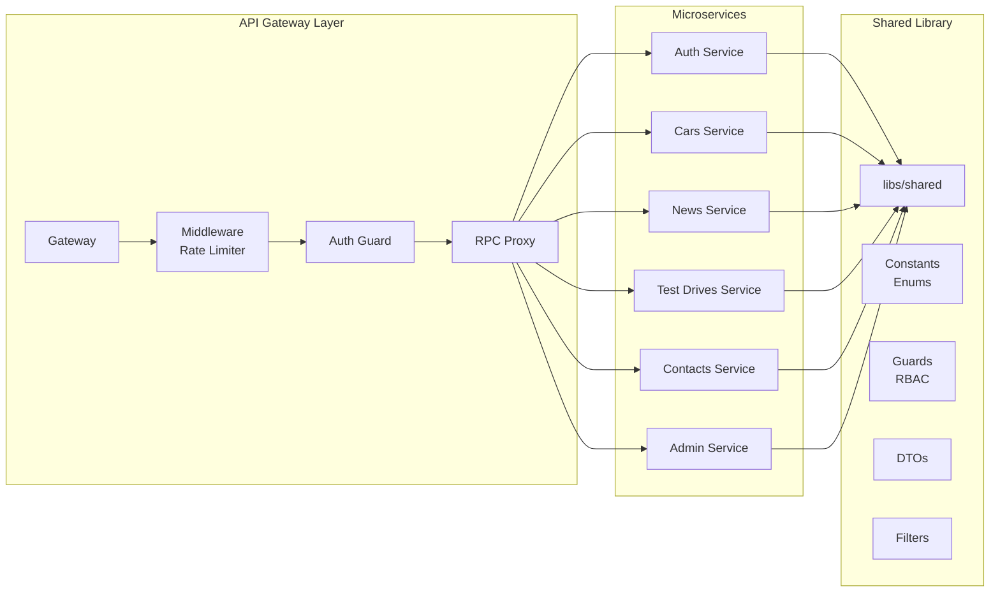

### 2.3 Frontend Architecture

```mermaid
graph TB
    subgraph "Next.js App Router"
        LAYOUT[Root Layout]

        subgraph "Public Routes"
            HOME[/]
            CARS[/cars]
            CAR_DETAIL[/cars/:slug]
            NEWS[/actualites]
            CONTACT[/contact]
            TESTDRIVE[/test-drive]
        end

        subgraph "Admin Routes (Protected)"
            ADMIN_LOGIN[/admin/login]
            ADMIN_DASH[/admin/dashboard]
            ADMIN_CARS[/admin/cars]
            ADMIN_NEWS[/admin/news]
            ADMIN_CONTACTS[/admin/contacts]
            ADMIN_TESTDRIVES[/admin/test-drives]
        end

        subgraph "Customer Portal (Protected)"
            CUSTOMER_LOGIN[/customer/login]
            CUSTOMER_REGISTER[/customer/register]
            CUSTOMER_DASH[/customer/dashboard]
            CUSTOMER_PROFILE[/customer/profile]
            CUSTOMER_TESTDRIVES[/customer/test-drives]
        end
    end

    subgraph "State Management"
        RQ[TanStack React Query]
        CTX[React Context<br/>Auth]
    end

    subgraph "API Layer"
        API[Axios Client]
        INTERCEPT[Interceptors]
    end

    LAYOUT --> HOME
    LAYOUT --> CARS
    LAYOUT --> CONTACT

    RQ --> API
    CTX --> API
    API --> INTERCEPT
```

---

## 3. Users & Roles

### 3.1 User Roles (from `libs/shared/src/constants.ts`)

| Role           | Description                                                                              |
| -------------- | ---------------------------------------------------------------------------------------- |
| **`ADMIN`**    | Full system access - can manage all entities, view dashboard, manage staff               |
| **`STAFF`**    | Limited admin access - can manage cars, test drives, contacts (no user management)       |
| **`CUSTOMER`** | Public user - can register, login, book test drives, submit contacts, manage own profile |

---

## 4. Use Cases by User Type

### 4.1 Anonymous/Guest Users (No Authentication)

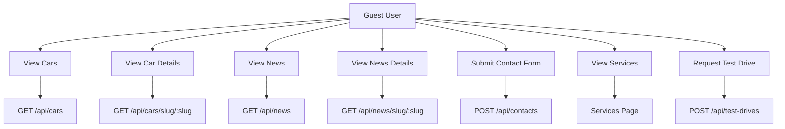

### 4.2 CUSTOMER (Registered Users)

| Use Case            | Endpoint                           | Methods                |
| ------------------- | ---------------------------------- | ---------------------- |
| Register            | `POST /api/auth/register`          | Create new account     |
| Login               | `POST /api/auth/login`             | Get JWT token          |
| Forgot Password     | `POST /api/auth/forgot-password`   | Request password reset |
| Reset Password      | `POST /api/auth/reset-password`    | Reset with token       |
| View Profile        | `GET /api/customers/me`            | Get own profile        |
| Update Profile      | `PATCH /api/customers/me`          | Update personal info   |
| Change Password     | `PATCH /api/customers/me/password` | Update password        |
| Schedule Test Drive | `POST /api/test-drives`            | Book a test drive      |
| View My Test Drives | `GET /api/test-drives`             | List own test drives   |
| Cancel Test Drive   | `DELETE /api/test-drives/:id`      | Cancel booking         |

### 4.3 STAFF (Dealership Staff)

| Use Case                  | Endpoint                     | Methods                  |
| ------------------------- | ---------------------------- | ------------------------ |
| All CUSTOMER capabilities | -                            | Plus:                    |
| Create Car                | `POST /api/cars`             | Add new car to inventory |
| Update Car                | `PUT /api/cars/:id`          | Edit car details         |
| Delete Car                | `DELETE /api/cars/:id`       | Remove car               |
| Upload Car Image          | `POST /api/cars/:id/image`   | Upload car photo         |
| Create News               | `POST /api/news`             | Publish news article     |
| Update News               | `PUT /api/news/:id`          | Edit news                |
| Delete News               | `DELETE /api/news/:id`       | Remove news              |
| View Test Drives          | `GET /api/test-drives`       | View all bookings        |
| Update Test Drive Status  | `PATCH /api/test-drives/:id` | Confirm/reject/complete  |
| View Contacts             | `GET /api/contacts`          | View all contacts        |
| Update Contact            | `PATCH /api/contacts/:id`    | Mark as read             |

### 4.4 ADMIN (System Administrator)

| Use Case               | Endpoint         | Methods                |
| ---------------------- | ---------------- | ---------------------- |
| All STAFF capabilities | -                | Plus:                  |
| Admin Dashboard        | `GET /api/admin` | View system statistics |

---

## 5. Frontend Analysis

### 5.1 Frontend Project Structure

```
baccouche-motors-frontend/
├── app/                          # Next.js App Router
│   ├── (public routes)           # Public pages
│   │   ├── page.tsx             # Home page
│   │   ├── about/page.tsx       # About page
│   │   ├── cars/page.tsx        # Cars listing
│   │   ├── cars/[slug]/page.tsx  # Car detail
│   │   ├── contact/page.tsx      # Contact page
│   │   ├── test-drive/page.tsx  # Test drive request
│   │   ├── services/page.tsx      # Services page
│   │   └── actualites/          # News (French)
│   │       ├── page.tsx
│   │       └── [slug]/page.tsx
│   ├── admin/                   # Admin dashboard
│   │   ├── login/page.tsx
│   │   ├── dashboard/page.tsx
│   │   ├── cars/
│   │   ├── news/
│   │   ├── contacts/
│   │   └── test-drives/
│   ├── customer/               # Customer portal
│   │   ├── login/page.tsx
│   │   ├── register/page.tsx
│   │   ├── dashboard/page.tsx
│   │   ├── profile/page.tsx
│   │   └── test-drives/
│   ├── layout.tsx
│   └── globals.css
├── components/
│   ├── ui/                      # shadcn/ui components
│   ├── admin/                   # Admin components
│   ├── customer/               # Customer components
│   ├── cars/                    # Car components
│   ├── home/                    # Homepage sections
│   ├── forms/                   # Form components
│   ├── layout/                   # Layout components
│   ├── auth/                    # Auth components
│   └── shared/                  # Shared components
├── lib/
│   ├── api/                     # API client & endpoints
│   ├── hooks/                   # React Query hooks
│   ├── auth-context.tsx          # Auth Context
│   ├── types/                    # TypeScript interfaces
│   └── utils.ts
├── cypress/                     # E2E tests
└── package.json
```

### 5.2 Frontend Routes

#### Public Routes

| Route                | Page               |
| -------------------- | ------------------ |
| `/`                  | Home page          |
| `/about`             | About page         |
| `/cars`              | Cars listing       |
| `/cars/[slug]`       | Car details        |
| `/contact`           | Contact form       |
| `/test-drive`        | Test drive request |
| `/services`          | Services page      |
| `/actualites`        | News listing       |
| `/actualites/[slug]` | News article       |

#### Admin Routes (Protected - Admin Role Required)

| Route                          | Page                |
| ------------------------------ | ------------------- |
| `/admin/login`                 | Admin login         |
| `/admin` or `/admin/dashboard` | Dashboard           |
| `/admin/cars`                  | Car management      |
| `/admin/cars/new`              | Create car          |
| `/admin/cars/edit/[id]`        | Edit car            |
| `/admin/news`                  | News management     |
| `/admin/news/new`              | Create news         |
| `/admin/news/edit/[id]`        | Edit news           |
| `/admin/contacts`              | Contact messages    |
| `/admin/test-drives`           | Test drive requests |

#### Customer Routes (Protected - Customer Role Required)

| Route                                | Page               |
| ------------------------------------ | ------------------ |
| `/customer/login`                    | Customer login     |
| `/customer/register`                 | Registration       |
| `/customer/forgot-password`          | Password recovery  |
| `/customer` or `/customer/dashboard` | Customer dashboard |
| `/customer/profile`                  | Profile management |
| `/customer/test-drives`              | My test drives     |

### 5.3 Frontend Components

```mermaid
graph BT
    subgraph "UI Components (shadcn/ui)"
        UI1[Button]
        UI2[Input]
        UI3[Card]
        UI4[Dialog]
        UI5[Form]
        UI6[Data Table]
        UI7[Rich Text Editor]
    end

    subgraph "Feature Components"
        FC1[Car Card]
        FC2[Car Grid]
        FC3[Image Gallery]
        FC4[Test Drive Form]
        FC5[Contact Form]
        FC6[Stats Cards]
        FC7[Charts]
    end

    subgraph "Layout Components"
        LC1[Site Chrome]
        LC2[Header]
        LC3[Footer]
        LC4[Admin Layout]
        LC5[Customer Layout]
    end

    subgraph "Auth Components"
        AC1[Auth Guard]
        AC2[Auth Context]
    end
```

### 5.4 Data Flow Architecture

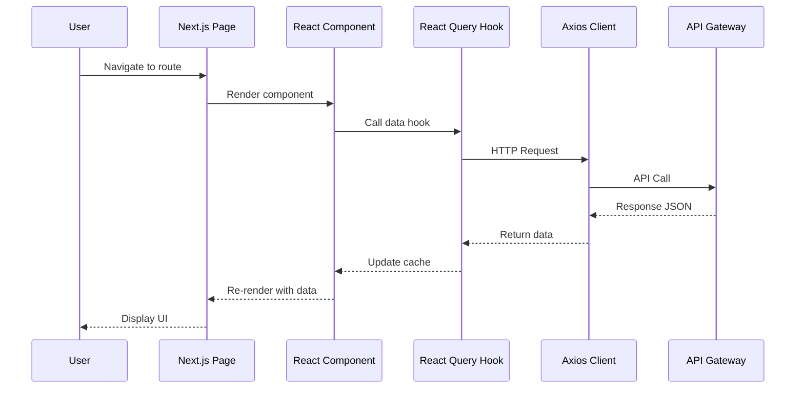

### 5.5 Authentication Flow

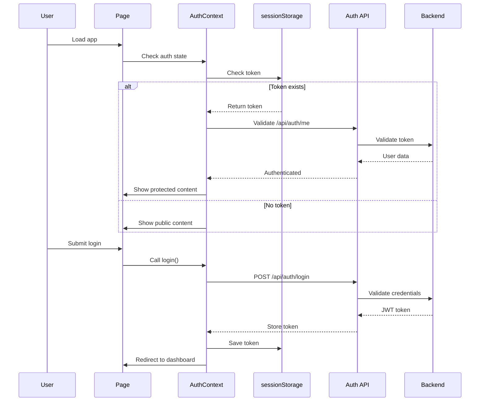

---

## 6. Backend Analysis

### 6.1 Backend Project Structure

```
baccouche-motors-backend/
├── apps/
│   ├── gateway/                   # API Gateway (entry point)
│   ├── auth/                   # Authentication microservice
│   ├── cars/                  # Cars inventory microservice
│   ├── news/                  # News/Blog microservice
│   ├── test-drives/           # Test drive scheduling
│   ├── contacts/              # Contact form microservice
│   ├── admin/                 # Admin dashboard microservice
│   └── baccouchemotorsapi/    # Legacy (deprecated)
├── libs/shared/                # Shared library
│   ├── src/
│   │   ├── guards/            # Auth guards
│   │   ├── decorators/        # Role decorators
│   │   ├── dto/             # Shared DTOs
│   │   ├── events/          # Events
│   │   ├── jwt/            # JWT utilities
│   │   ├── filters/         # Exception filters
│   │   └── constants.ts     # Enums
├── uploads/                   # File uploads
├── scripts/                   # Build scripts
└── docs/                     # OpenAPI docs
```

### 6.2 Docker Services

| Service     | Port      | Description              |
| ----------- | --------- | ------------------------ |
| Gateway     | 3500      | API Gateway              |
| Auth        | 3501      | Auth microservice        |
| Cars        | 3502      | Cars microservice        |
| News        | 3503      | News microservice        |
| Test Drives | 3504      | Test drives microservice |
| Contacts    | 3505      | Contacts microservice    |
| Admin       | 3506      | Admin microservice       |
| PostgreSQL  | 5432/5433 | Database                 |
| RabbitMQ    | 5672      | Message broker           |

---

## 7. Entities & Database Schema

### 7.1 Database: PostgreSQL (Polyglot Persistence)

- `baccouche_auth` - Users
- `baccouche_cars` - Car inventory
- `baccouche_news` - News articles
- `baccouche_test_drives` - Test drive bookings
- `baccouche_contacts` - Contact form submissions

### 7.2 Entity Class Diagrams

#### User Entity

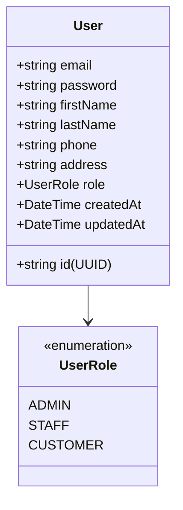

#### Car Entity

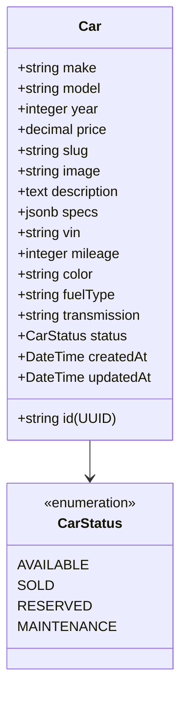

#### News Entity

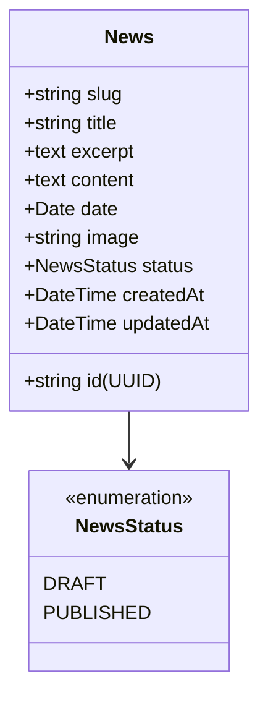

#### TestDrive Entity

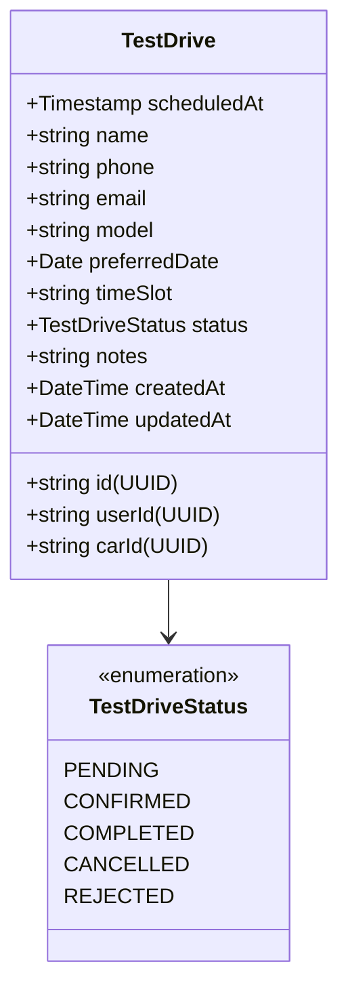

#### Contact Entity

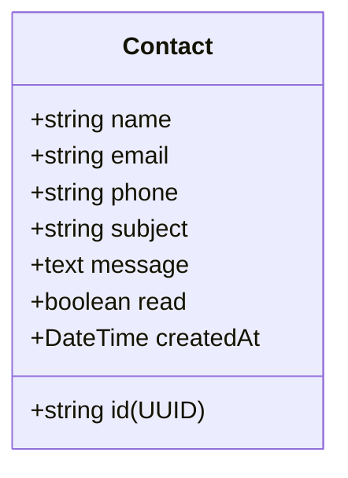

### 7.3 Complete Entity Relationship Diagram

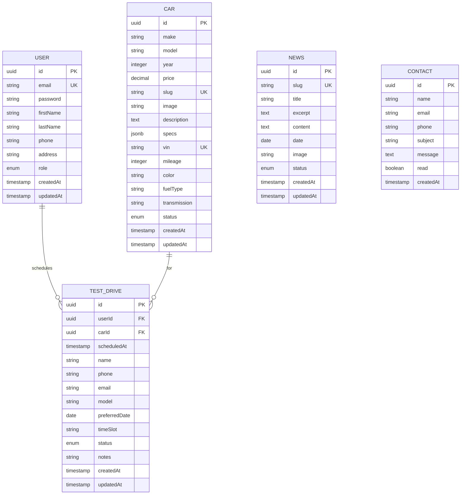

---

## 8. API Endpoints Summary

### 8.1 Gateway Routes

| Controller  | Base Path              | Methods                                                       |
| ----------- | ---------------------- | ------------------------------------------------------------- |
| Auth        | `/api/auth`            | POST register, login, logout, forgot-password, reset-password |
| Customers   | `/api/customers`       | GET me, PATCH me, PATCH me/password                           |
| Cars        | `/api/cars`            | GET, POST, GET :id, PUT :id, DELETE :id                       |
| Cars        | `/api/cars/stats`      | GET (statistics)                                              |
| Cars        | `/api/cars/slug/:slug` | GET (by slug)                                                 |
| Cars        | `/api/cars/:id/image`  | POST (upload image)                                           |
| News        | `/api/news`            | GET, POST, GET :id, PUT :id, DELETE :id                       |
| News        | `/api/news/stats`      | GET (statistics)                                              |
| News        | `/api/news/slug/:slug` | GET (by slug)                                                 |
| News        | `/api/news/:id/image`  | POST (upload image)                                           |
| Test Drives | `/api/test-drives`     | GET, POST, GET :id, PATCH :id, DELETE :id                     |
| Contacts    | `/api/contacts`        | GET, POST, GET :id, PATCH :id, DELETE :id                     |
| Admin       | `/api/admin`           | GET dashboard                                                 |
| Health      | `/`                    | GET                                                           |

---

## 9. Infrastructure & Deployment

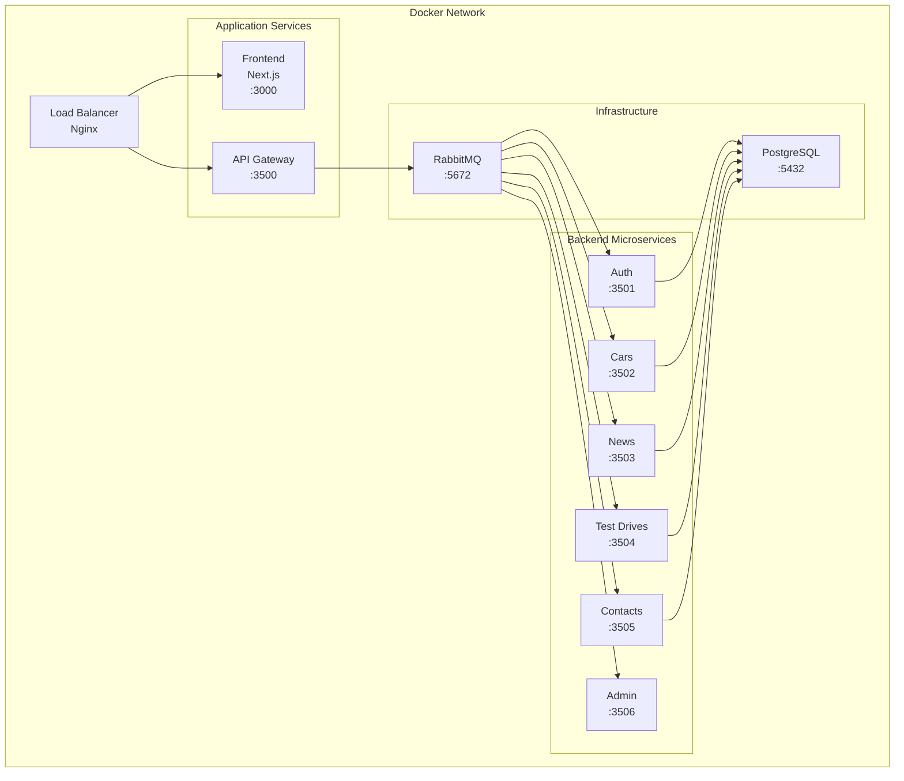

---

## 10. Security Features

| Feature                   | Implementation                      |
| ------------------------- | ----------------------------------- |
| JWT Authentication        | Token-based with 7-day expiry       |
| Password Hashing          | bcrypt                              |
| Rate Limiting             | Throttler (10 req/sec, 100 req/min) |
| Role-based Access Control | GatewayRolesGuard                   |
| Input Validation          | class-validator DTOs                |
| Frontend Auth Guard       | Route protection component          |
| Session Storage           | Token in sessionStorage             |

---

## 11. UML Diagrams

### 11.1 System Architecture Diagram

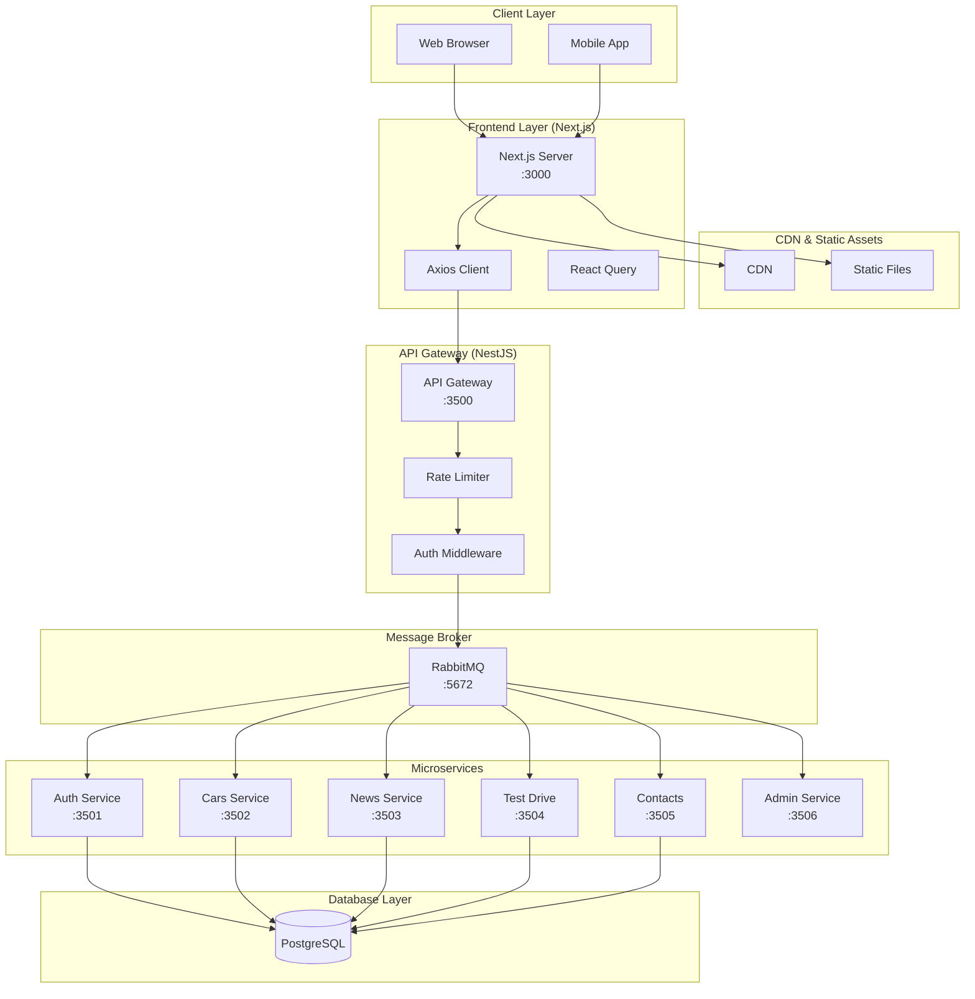

### 11.2 Use Case Diagram

```mermaid
useCase
    actor "Guest" as Guest
    actor "Customer" as Customer
    actor "Staff" as Staff
    actor "Admin" as Admin

    package "Public Features" {
        UC1[View Cars]
        UC2[View Car Details]
        UC3[View News]
        UC4[View News Article]
        UC5[Contact Support]
        UC6[Request Test Drive]
    }

    package "Customer Features" {
        UC7[Register]
        UC8[Login]
        UC9[Manage Profile]
        UC10[Book Test Drive]
        UC11[View My Test Drives]
        UC12[Cancel Test Drive]
    }

    package "Staff Features" {
        UC13[Manage Cars]
        UC14[Manage News]
        UC15[Manage Test Drives]
        UC16[Manage Contacts]
    }

    package "Admin Features" {
        UC17[View Dashboard]
        UC18[Manage Users]
    }

    Guest --> UC1
    Guest --> UC2
    Guest --> UC3
    Guest --> UC4
    Guest --> UC5
    Guest --> UC6

    Customer --> UC7
    Customer --> UC8
    Customer --> UC9
    Customer --> UC10
    Customer --> UC11
    Customer --> UC12

    Staff --> UC1
    Staff --> UC2
    Staff --> UC3
    Staff --> UC4
    Staff --> UC5

    Admin --> UC13
    Admin --> UC14
    Admin --> UC15
    Admin --> UC16
    Admin --> UC17
    Admin --> UC18
```

### 11.3 Login Sequence Diagram

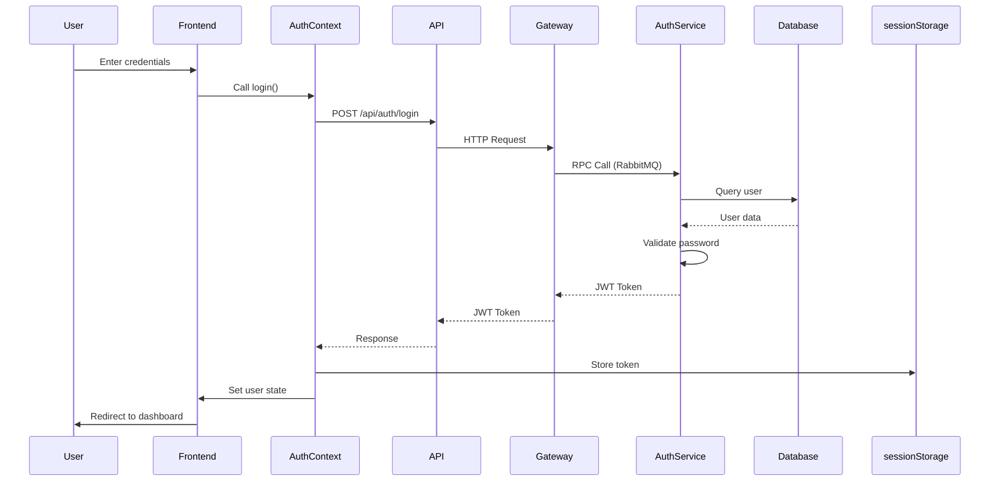

### 11.4 Book Test Drive Sequence Diagram

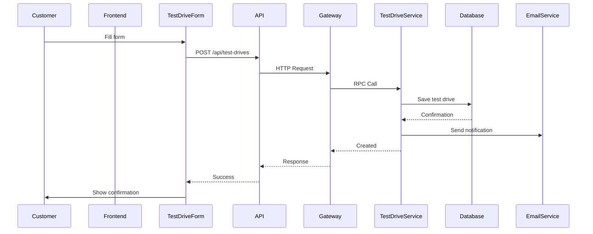

### 11.5 Component Diagram (Frontend)

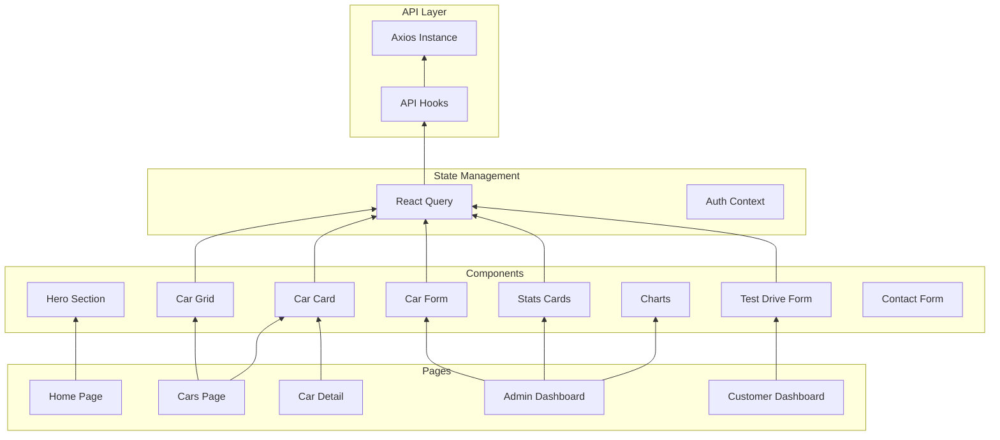

### 11.6 Database Schema Diagram


### 11.7 State Machine Diagram (Test Drive)

```mermaid
stateDiagram-v2
    [*] --> PENDING: Created

    PENDING --> CONFIRMED: Staff confirms
    PENDING --> REJECTED: Staff rejects
    PENDING --> CANCELLED: Customer cancels

    CONFIRMED --> COMPLETED: Test drive completed
    CONFIRMED --> CANCELLED: Customer cancels

    REJECTED --> [*]
    COMPLETED --> [*]
    CANCELLED --> [*]
```

### 11.8 State Machine Diagram (Car Status)

```mermaid
stateDiagram-v2
    [*] --> AVAILABLE: Car added

    AVAILABLE --> RESERVED: Customer reserves
    AVAILABLE --> SOLD: Car sold
    AVAILABLE --> MAINTENANCE: Needs maintenance

    RESERVED --> SOLD: Sale completed
    RESERVED --> AVAILABLE: Reservation cancelled

    MAINTENANCE --> AVAILABLE: Maintenance done

    SOLD --> [*]
```

---

## 12. Summary

### 12.1 Project Summary

| Aspect            | Backend       | Frontend           |
| ----------------- | ------------- | ------------------ |
| **Architecture**  | Microservices | Next.js App Router |
| **Communication** | RabbitMQ RPC  | Axios              |
| **Framework**     | NestJS v11    | Next.js 16.1.6     |
| **Language**      | TypeScript    | TypeScript         |
| **Database**      | PostgreSQL    | N/A                |
| **ORM**           | TypeORM       | N/A                |

### 12.2 User Roles Summary

| Role         | Access Level | Description                 |
| ------------ | ------------ | --------------------------- |
| **ADMIN**    | Full         | Complete system access      |
| **STAFF**    | Medium       | Manage content and bookings |
| **CUSTOMER** | Limited      | Personal account access     |
| **GUEST**    | Public       | Browse and inquire          |

### 12.3 Core Features Summary

| Feature         | Frontend Page         | Backend Endpoint       |
| --------------- | --------------------- | ---------------------- |
| Car Catalog     | `/cars`               | `/api/cars`            |
| Car Details     | `/cars/:slug`         | `/api/cars/slug/:slug` |
| News            | `/actualites`         | `/api/news`            |
| Contact Form    | `/contact`            | `/api/contacts`        |
| Test Drive      | `/test-drive`         | `/api/test-drives`     |
| Admin Dashboard | `/admin/dashboard`    | `/api/admin`           |
| Customer Portal | `/customer/dashboard` | `/api/customers`       |

### 12.4 Enums Reference

#### UserRole

```typescript
enum UserRole {
  ADMIN = 'admin',
  STAFF = 'staff',
  CUSTOMER = 'customer',
}
```

#### TestDriveStatus

```typescript
enum TestDriveStatus {
  PENDING = 'pending',
  CONFIRMED = 'confirmed',
  COMPLETED = 'completed',
  CANCELLED = 'cancelled',
  REJECTED = 'rejected',
}
```

#### NewsStatus

```typescript
enum NewsStatus {
  DRAFT = 'draft',
  PUBLISHED = 'published',
}
```

#### CarStatus

```typescript
enum CarStatus {
  AVAILABLE = 'available',
  SOLD = 'sold',
  RESERVED = 'reserved',
  MAINTENANCE = 'maintenance',
}
```

---

_Report generated for Baccouche Motors Application - Full Stack Review_
